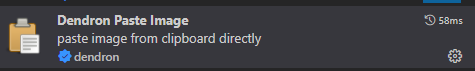
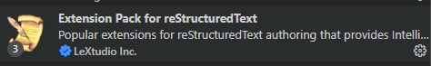
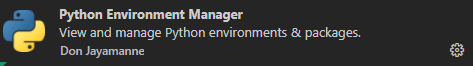
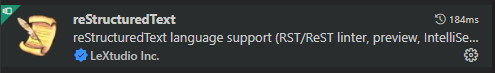
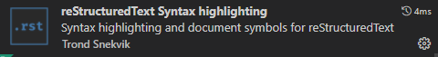

Avengineers' Web Presence
*************************

The sources behind https://avengineers.github.io/

Development Environment
-----------------------

  Note: For documentation on Sphinx, see `sphinxPrimer link`_.

  .. _sphinxPrimer link: https://www.sphinx-doc.org/en/master/usage/restructuredtext/basics.html

Clone the repository
"""""""""""""""""""""""""""""""""""""""""""""""
   ``git clone https://github.com/avengineers/avengineers.github.io.git``

Install the python virtual environment
"""""""""""""""""""""""""""""""""""""""""""""""
   ``pip install pipenv``

   ``pipenv install``

Enable auto-building into build folder, triggered by source code change
"""""""""""""""""""""""""""""""""""""""""""""""""""""""""""""""""""""""""
  ``pipenv run sphinx-autobuild.exe . build``

Visual Studio Code Extensions
""""""""""""""""""""""""""""""

   apply the following settings within ``Dendrom Paste Image``

     .. figure:: _figures/2022-10-04-10-54-44.png
     .. figure:: _figures/2022-10-04-10-56-21.png

